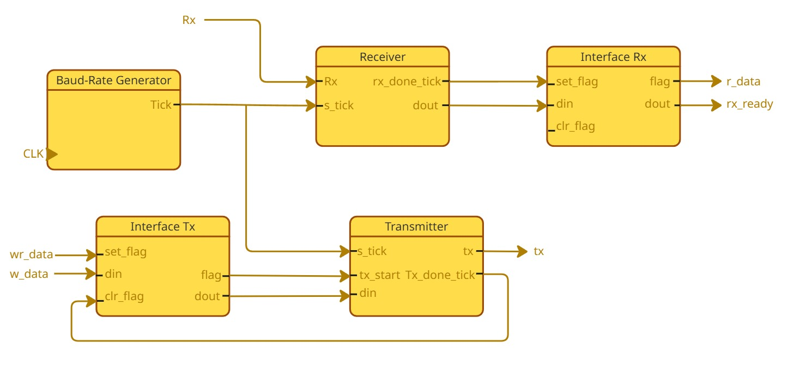

# UART in Verilog

## 🧠 Architecture

---

## 🔗 Blocks Description
- [Baud Rate Generator](docs/baudrate.md)
- [Receiver](docs/receiver.md)
- [Transmitter](docs/transmitter.md)
- [Interface ](docs/interface.md)

---

## 🔁 Data Flow

RX:
rx → receiver → interface → r_data

TX:
w_data → interface → transmitter → tx
