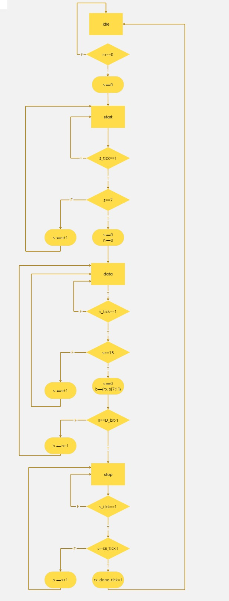

# Receiver

## ASMD Diagram

---

## Description

The receiver is implemented as a Finite State Machine with Datapath (FSMD).

### States

- **Idle**: Waits for start bit (rx = 0)
- **Start**: Validates start bit at its midpoint
- **Data**: Receives 8 bits using oversampling
- **Stop**: Waits for stop bit and signals completion

---

## Key Features

- 16x oversampling
- Mid-bit sampling for reliability
- Shift register for data reception
