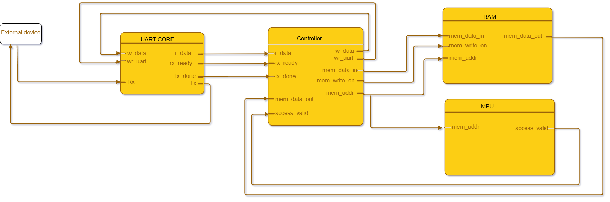
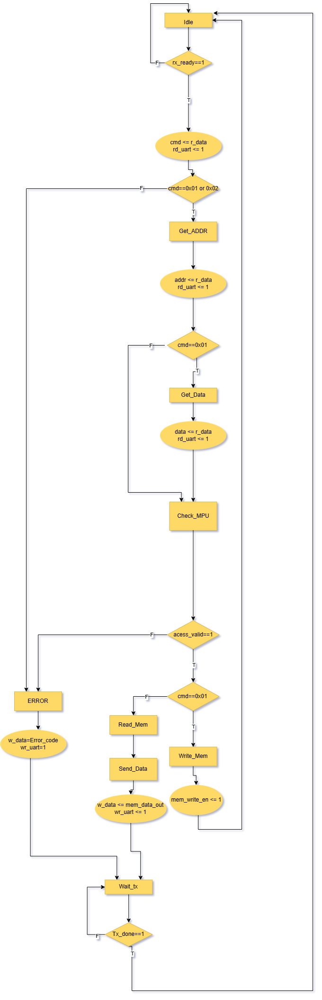
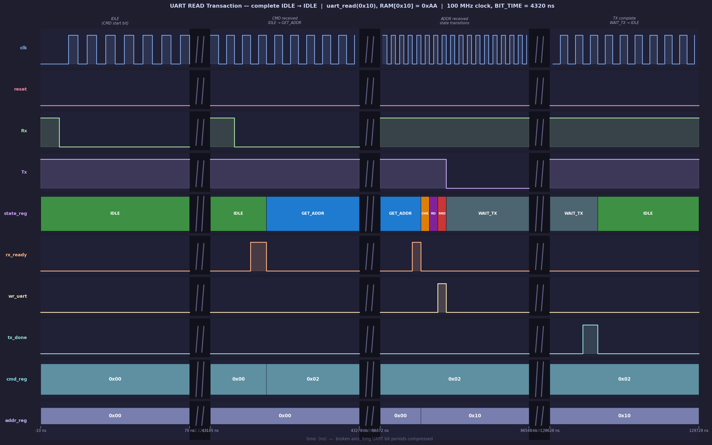

# UART Memory System with MPU Protection

## Overview

This project implements a complete UART-controlled memory system in SystemVerilog.

The architecture allows an external device to communicate with an internal RAM memory through a UART serial interface. The system supports both READ and WRITE operations while enforcing memory protection rules using an MPU (Memory Protection Unit).

The complete system was designed, simulated and verified in Vivado using self-checking verification techniques and randomized testing.

---

# Main Features

* UART serial communication
* Finite State Machine (FSM) controller
* RAM memory subsystem
* MPU-based memory protection
* READ and WRITE transactions
* Error handling mechanism
* Self-checking SystemVerilog testbench
* Randomized verification
* UART TX monitor implementation
* Scoreboard-based verification
* Waveform debugging and timing analysis

---

# System Architecture

The system is composed of the following modules:

* UART Receiver
* UART Transmitter
* UART Core
* Controller FSM
* RAM Memory
* MPU
* Top-Level Integration

The Controller FSM coordinates all system operations and supervises communication between the different internal modules.



---

# Supported UART Protocol

## WRITE Transaction

The external device transmits:

```text
[WRITE_CMD] [ADDRESS] [DATA]
```

Example:

```text
01 10 AA
```

This stores the value `0xAA` at memory address `0x10`.

---

## READ Transaction

The external device transmits:

```text
[READ_CMD] [ADDRESS]
```

Example:

```text
02 10
```

The system responds with the value stored at address `0x10`.

---

# Controller FSM

The controller is implemented as a synchronous finite state machine.

Implemented states:

* IDLE
* GET_ADDR
* GET_DATA
* CHECK_MPU
* READ_MEM
* SEND_DATA
* WRITE_MEM
* ERROR
* WAIT_TX

The FSM supervises:

* UART synchronization
* Memory access validation
* RAM operations
* UART response generation
* Error handling
  
    

---

# Verification Methodology

The system was verified using a self-checking SystemVerilog testbench.

Implemented verification features:

* Directed tests
* Randomized tests
* UART protocol monitor
* Scoreboard verification
* Automatic PASS/FAIL reporting
* Timeout protection
* Functional checking of READ/WRITE operations
* Invalid command testing
* MPU protection testing

---

# UART Verification Bug and Debugging

One of the most important debugging challenges during verification involved UART transmission synchronization.

## Problem

The DUT started transmitting the UART response before the final `uart_send_byte()` task completed.

This caused the testbench monitor to miss the real UART start bit:

```systemverilog
uart_send_byte(addr);
uart_receive_byte(rx_byte);
```

The monitor started too late and sampled misaligned UART bits.

This produced:

* Incorrect received values
* Shifted UART frames
* Simulation timeouts during error responses

---

## Root Cause

The DUT processed the received UART byte during the stop-bit window of the final transmitted byte.

As a consequence, the UART transmitter began responding before the testbench had started waiting for the `negedge Tx` start bit.

---

## Fix

The issue was solved using concurrent execution with `fork...join`:

```systemverilog
fork
    uart_receive_byte(rx_byte);
    uart_send_byte(addr);
join
```

This ensured that the UART monitor was already active before the DUT started transmitting.

---

# Technologies Used

* SystemVerilog
* Vivado Simulator
* FSM-based RTL design
* UART serial communication
* Digital verification methodologies

---

# Simulation Results

The final verification environment successfully passed:

* Directed READ/WRITE tests
* Invalid command tests
* MPU protection tests
* Randomized transaction tests

Final simulation summary:

```text
TESTS PASSED = 26
TESTS FAILED = 0
```
   


---

# Future Improvements

Potential future extensions:

* UVM verification environment
* Functional coverage
* Assertions (SVA)
* FIFO buffering
* Multiple memory regions
* Interrupt support
* FPGA implementation

---

# Author

Digital Design and Verification Project developed in SystemVerilog using Vivado.

